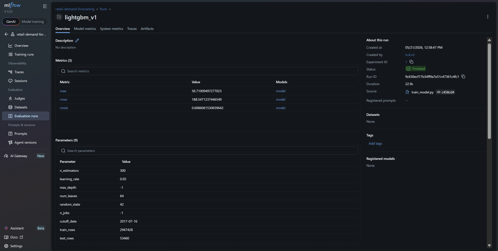
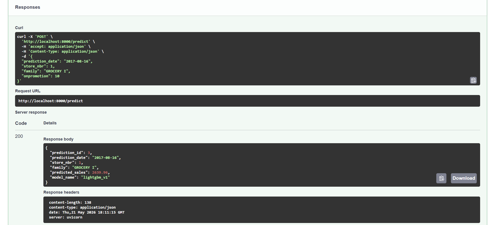
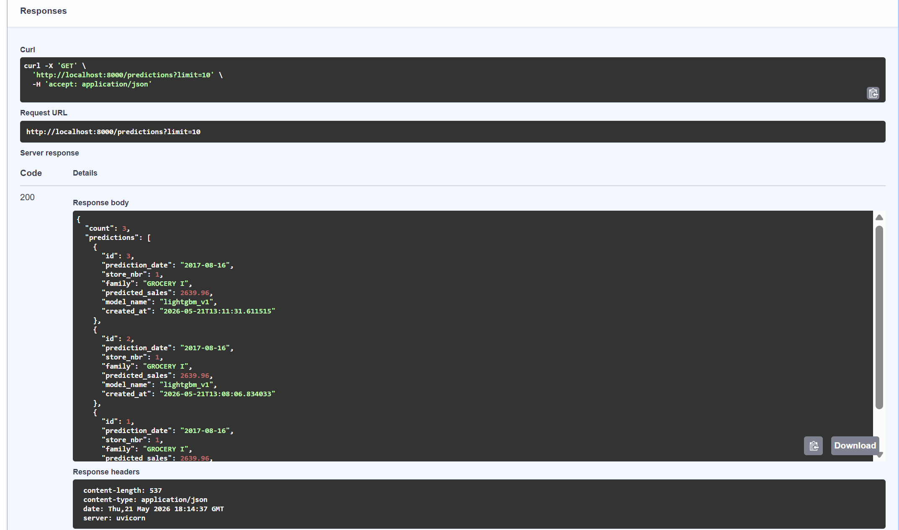

# Retail Demand Forecasting with MLOps

This project is an end-to-end machine learning system that predicts future retail product demand using historical sales data.

The goal of this project is not only to train a forecasting model, but also to build it in a production-style workflow using **MLflow**, **FastAPI**, **PostgreSQL**, and **Docker**.

---

## Project Summary

Retail businesses need to estimate future demand so they can plan inventory, reduce stock shortages, avoid overstocking, and make better business decisions.

This project predicts future sales for a given:

- Date
- Store number
- Product family
- Promotion count

The system trains a machine learning model, tracks experiments, serves predictions through an API, and stores prediction results in a PostgreSQL database.

---

## System Workflow

```text
Raw Sales Data
      ↓
Data Cleaning and Preprocessing
      ↓
Feature Engineering
      ↓
Model Training
      ↓
Experiment Tracking with MLflow
      ↓
Saved Model Artifacts
      ↓
FastAPI Prediction Service
      ↓
PostgreSQL Prediction Storage
      ↓
API Results and Documentation
```

---

## Tech Stack

| Technology | Purpose |
|---|---|
| Python | Main programming language |
| Pandas | Data cleaning and transformation |
| NumPy | Numerical operations |
| Scikit-learn | Evaluation metrics and ML utilities |
| LightGBM | Machine learning model for sales forecasting |
| MLflow | Experiment tracking and model logging |
| FastAPI | API service for predictions |
| PostgreSQL | Database for storing prediction results |
| SQLAlchemy | Python-to-database connection |
| Docker | Runs PostgreSQL and MLflow services |
| Uvicorn | Runs the FastAPI application |

---

## Key Concepts

### Demand Forecasting

Demand forecasting means predicting how much of a product may be sold in the future.

Example:

```text
Predict sales for:
Date: 2017-08-16
Store: 1
Product Family: GROCERY I
Promotion Count: 10
```

---

### Feature Engineering

Feature engineering means creating useful input columns for the machine learning model.

For example, from a date column, we create:

```text
day
week
month
year
day_of_week
is_weekend
```

We also create sales history features:

```text
lag_1
lag_7
lag_14
lag_28
rolling_mean_7
rolling_mean_14
rolling_mean_28
```

These features help the model learn past sales patterns.

---

### MLflow

MLflow is used to track model experiments.

It records:

- Model parameters
- MAE
- RMSE
- RMSLE
- Training rows
- Testing rows
- Model artifacts

This makes it easier to compare model runs and keep track of the best model.

---

### FastAPI

FastAPI is used to create a prediction API.

The API allows users to send input data and receive predicted sales as output.

FastAPI also provides automatic Swagger documentation at:

```text
http://localhost:8000/docs
```

---

### PostgreSQL

PostgreSQL is used to store prediction results.

Every time a prediction is made through the API, the result is saved in the database.

---

### Docker

Docker is used to run supporting services in containers.

This project uses Docker for:

- PostgreSQL
- MLflow

FastAPI is currently run locally through the Python virtual environment.

---

## Dataset

This project uses the Kaggle **Store Sales - Time Series Forecasting** dataset.

Expected raw files:

```text
data/raw/train.csv
data/raw/test.csv
data/raw/stores.csv
data/raw/transactions.csv
data/raw/holidays_events.csv
data/raw/oil.csv
```

The raw dataset files are not pushed to GitHub because they are large and environment-specific.

---

## Project Structure

```text
retail-demand-forecasting-mlops/
│
├── data/
│   ├── raw/
│   │   └── Raw dataset files
│   └── processed/
│       └── Processed and feature-engineered files
│
├── docker/
│   └── Dockerfile
│
├── models/
│   └── Trained model artifacts
│
├── notebooks/
│   └── Exploratory analysis notebooks
│
├── results/
│   ├── mlflow_experiment.png
│   ├── fastapi_docs.png
│   ├── predict_response.png
│   ├── predictions_response.png
│   ├── postgres_predictions.png
│   └── project_structure.png
│
├── src/
│   ├── api/
│   │   └── main.py
│   │
│   ├── data/
│   │   ├── check_raw_data.py
│   │   └── preprocess.py
│   │
│   ├── database/
│   │   ├── db.py
│   │   └── schema.sql
│   │
│   ├── features/
│   │   └── build_features.py
│   │
│   └── models/
│       ├── train_model.py
│       └── predict.py
│
├── .dockerignore
├── .env.example
├── .gitignore
├── config.yaml
├── docker-compose.yml
├── README.md
└── requirements.txt
```

---

## Features Used by the Model

The model uses the following features:

```text
store_nbr
family
onpromotion
city
state
store_type
cluster
dcoilwtico
transactions
is_holiday
holiday_type
holiday_description
day
week
month
year
day_of_week
is_weekend
lag_1
lag_7
lag_14
lag_28
rolling_mean_7
rolling_mean_14
rolling_mean_28
```

---

## Model

The current model is a **LightGBM Regressor**.

LightGBM is a gradient boosting model that works well for structured tabular data. Since this project uses sales, store, date, promotion, holiday, and transaction features, LightGBM is a strong choice for this type of forecasting problem.

---

## Evaluation Metrics

The model is evaluated using:

| Metric | Meaning |
|---|---|
| MAE | Average absolute difference between actual and predicted sales |
| RMSE | Penalizes larger prediction errors more strongly |
| RMSLE | Useful when sales values have a wide range |

Lower values mean better model performance.

---

## Database Table

Predictions are stored in PostgreSQL using this table:

```sql
CREATE TABLE IF NOT EXISTS predictions (
    id SERIAL PRIMARY KEY,
    prediction_date DATE NOT NULL,
    store_nbr INT NOT NULL,
    family VARCHAR(100) NOT NULL,
    predicted_sales FLOAT NOT NULL,
    model_name VARCHAR(100) NOT NULL,
    created_at TIMESTAMP DEFAULT CURRENT_TIMESTAMP
);
```

---

## Setup Instructions

### 1. Clone the Repository

```bash
git clone https://github.com/YOUR_USERNAME/retail-demand-forecasting-mlops.git
cd retail-demand-forecasting-mlops
```

Replace `YOUR_USERNAME` with your GitHub username.

---

### 2. Create Virtual Environment

For Windows:

```bash
python -m venv .venv
.venv\Scripts\activate
```

---

### 3. Install Dependencies

```bash
pip install -r requirements.txt
```

---

### 4. Add Dataset Files

Download the dataset and place the files inside:

```text
data/raw/
```

Required files:

```text
train.csv
test.csv
stores.csv
transactions.csv
holidays_events.csv
oil.csv
```

---

### 5. Start PostgreSQL and MLflow

```bash
docker compose up -d postgres mlflow
```

Check running containers:

```bash
docker ps
```

Expected containers:

```text
retail_forecast_db
retail_forecast_mlflow
```

---

### 6. Verify Database Connection

```bash
python src/database/db.py
```

Expected output:

```text
Database connected successfully.
```

---

### 7. Run Data Pipeline

```bash
python src/data/check_raw_data.py
python src/data/preprocess.py
python src/features/build_features.py
```

---

### 8. Train Model with MLflow Tracking

For Windows CMD:

```bash
set MLFLOW_TRACKING_URI=http://localhost:5000
python src/models/train_model.py
```

For PowerShell:

```powershell
$env:MLFLOW_TRACKING_URI="http://localhost:5000"
python src/models/train_model.py
```

Open MLflow:

```text
http://localhost:5000
```

---

### 9. Run FastAPI

```bash
uvicorn src.api.main:app --reload
```

Open API documentation:

```text
http://localhost:8000/docs
```

---

## API Endpoints

### Root Endpoint

```http
GET /
```

Checks whether the API is running.

---

### Health Check

```http
GET /health
```

Example response:

```json
{
  "status": "healthy",
  "timestamp": "2026-05-21T10:30:00"
}
```

---

### Predict Sales

```http
POST /predict
```

Example request:

```json
{
  "prediction_date": "2017-08-16",
  "store_nbr": 1,
  "family": "GROCERY I",
  "onpromotion": 10
}
```

Example response:

```json
{
  "prediction_id": 1,
  "prediction_date": "2017-08-16",
  "store_nbr": 1,
  "family": "GROCERY I",
  "predicted_sales": 435.72,
  "model_name": "lightgbm_v1"
}
```

---

### View Recent Predictions

```http
GET /predictions
```

Example response:

```json
{
  "count": 1,
  "predictions": [
    {
      "id": 1,
      "prediction_date": "2017-08-16",
      "store_nbr": 1,
      "family": "GROCERY I",
      "predicted_sales": 435.72,
      "model_name": "lightgbm_v1",
      "created_at": "2026-05-21T10:35:00"
    }
  ]
}
```

---

## Results

### MLflow Experiment Tracking

The model training run is logged in MLflow with metrics, parameters, and model artifacts.



---

---

### Prediction API Response

The `/predict` endpoint returns predicted sales and saves the result to PostgreSQL.



---

### Recent Predictions API Response

The `/predictions` endpoint returns recent prediction records from the database.



---

### PostgreSQL Prediction Table

Prediction outputs are stored in the PostgreSQL `predictions` table.


---

---

## End-to-End Run

Use these commands to run the full project locally:

```bash
docker compose up -d postgres mlflow
python src/database/db.py
python src/data/check_raw_data.py
python src/data/preprocess.py
python src/features/build_features.py
set MLFLOW_TRACKING_URI=http://localhost:5000
python src/models/train_model.py
uvicorn src.api.main:app --reload
```

Then open:

```text
http://localhost:8000/docs
```

Test the `/predict` and `/predictions` endpoints.

---

## Environment Variables

Example `.env.example` file:

```env
DB_USER=retail_user
DB_PASSWORD=retail_pass
DB_HOST=localhost
DB_PORT=5432
DB_NAME=retail_forecasting

MLFLOW_TRACKING_URI=http://localhost:5000
```

---

## Files Not Pushed to GitHub

The following files and folders are ignored:

```text
data/raw/
data/processed/
models/
mlruns/
mlartifacts/
.venv/
.env
```

These files are either large, generated locally, or environment-specific.

---

## Troubleshooting

### Database Password Authentication Failed

Reset the PostgreSQL container and volume:

```bash
docker compose down -v
docker compose up -d postgres
python src/database/db.py
```

---

### Predictions Table Missing

Run:

```bash
docker exec -i retail_forecast_db psql -U retail_user -d retail_forecasting < src/database/schema.sql
```

---

### MLflow Is Not Opening

Check containers:

```bash
docker ps
```

Start MLflow again:

```bash
docker compose up -d mlflow
```

Then open:

```text
http://localhost:5000
```

---

### FastAPI Import Error

Make sure the command is run from the project root:

```bash
uvicorn src.api.main:app --reload
```

Do not run this command from inside the `src` folder.

---

### Model File Not Found

Run the training script first:

```bash
python src/models/train_model.py
```

This creates:

```text
models/lightgbm_model.joblib
models/features.json
models/encoders.json
```

---

## Current Status

Completed:

- Raw data validation
- Data preprocessing
- Feature engineering
- LightGBM model training
- MLflow experiment tracking
- PostgreSQL prediction storage
- FastAPI prediction API
- Docker Compose setup for PostgreSQL and MLflow
- Final result screenshots

---

## Future Improvements

Possible future improvements:

- Multi-day recursive forecasting
- Streamlit dashboard
- Automated retraining pipeline
- Dockerized FastAPI service
- AWS deployment
- GitHub Actions CI/CD
- Data drift monitoring using Evidently AI
- More advanced time series models

---

## Author

Sai Prasad Reddy Kukudala